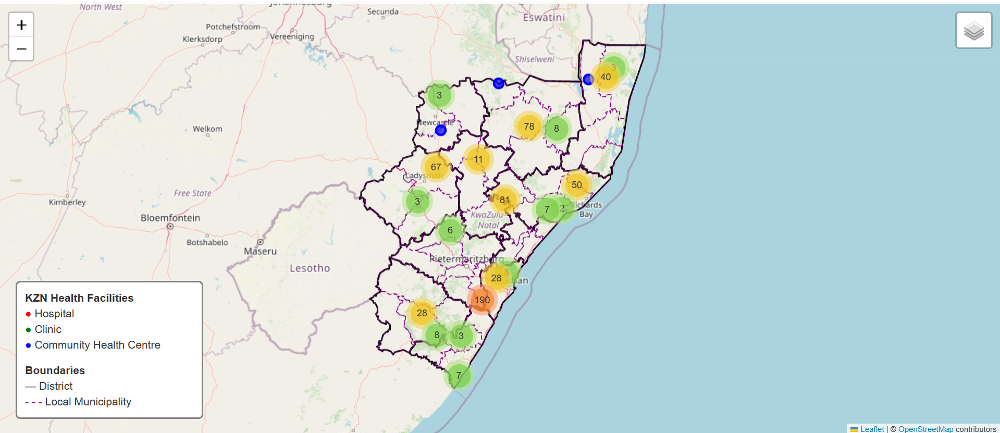

# Nikita Harripersadh 
## GIS Analyst | Geospatial Data | Cartography | Spatial Analysis
Turning geographic data into meaningful maps, analysis, and interactive visualisations.

## About Me
I'm an **Environmental Science graduate and aspiring Geospatial Developer** interested in the intersection of **GIS, software development, spatial data, and web technologies**.

I enjoy working with geographic data and building tools that make spatial information easier to **process, analyse, visualise, and interact with**.

My current experience includes **Python, GeoPandas, Pandas, QGIS, ArcGIS Pro, Folium, Leaflet, GeoJSON, and spatial data processing**.

I'm currently expanding my software development skills with a focus on **geospatial applications, APIs, databases, and web mapping**.

## Tech Stack

### Programming

  
  
  
  

---

### Geospatial

  
  
  
  
  
  
  

**Geospatial Concepts**

- Vector & Raster Data
- Coordinate Reference Systems (CRS)
- Spatial Analysis
- Spatial Data Processing
- GeoJSON

---

### Data & Analytics

  
  

- Data Cleaning
- Data Transformation
- Spatial Data Processing
- Data Visualisation
- CSV
- JSON
- GeoJSON
- Jupyter Notebooks

---

### Development

  
  

- Git & GitHub
- REST APIs
- Web Mapping
- Data Pipelines
- JSON
- GeoJSON
- Object-Oriented Programming
- Software Development Fundamentals

## Side Projects
**KZN Health Facilities Interactive Dashboard**

**Description:**
A web-ready interactive visualization, here this interactive map visualizes healthcare facilities across KwaZulu-Natal (KZN), South Africa, including hospitals, clinics, and community health centres (CHCs). Users can explore geographic distribution, view administrative boundaries, and interact with detailed facility information.

**Key Features:**

**Interactive Map:** Zoom, pan, and toggle layers for districts, local municipalities, and healthcare facilities.

**Facility Clustering:** Marker clusters for hospitals, clinics, and CHCs make it easy to explore dense areas.

**Popups & Tooltips:** Click markers to see facility name, town/city, and district; hover over boundaries to see district or municipality names.

**Custom Legend & Layer Control:** Clear visualization of boundaries and facility types with a dynamic layer toggle.

**Data Integration:** Combines multiple CSV datasets and GeoJSON administrative boundaries in a single dashboard.

**Built With:** Python (pandas, geopandas, folium), HTML, and Leaflet.js for interactivity.

**Purpose:**
The dashboard provides a spatial overview of healthcare infrastructure in KZN, supporting research, planning, or public information awareness. It demonstrates skills in data cleaning, geospatial analysis, and interactive mapping.

[Watch the KZN Dashboard Demo](https://youtu.be/zaUfj0HtFZo).

**Check out the interactive map here:**  https://nikita-harripersadh.github.io/kzn-health-dashboard/.

**Earthquake Data**

A simple map of Earthquake data (2000 - 2020) to highlight and demonstrate basic workflow of importing data layers, applying symbology, adding labels, and designing layouts for maps.

**New York Population Density**

A map layout that uses geographic boundaries and population count data for the City of New York and results in a population density map. This requires doing a table join and using a graduated symbology to create a choropleth map.

## QGIS Internship Work

**Organization:** Kartoza  
**Duration:** August 2025 – November 2025  
**Focus:** Practical QGIS workflows, mapping, and spatial data analysis

### Internship Projects

### 1. Map for a Scientific Publication
- **Description:** This exercise simulated a client request to create a publication-ready map using QGIS, with the purpose of following the detailed specifications to export it as a PDF and PNG file for inclusion in a scientific paper.
- **Tools Used:** QGIS
- **Learning Outcomes:** 
- Create and manage GeoPackages.
- Import layers into GeoPackages.
- Add new attribute data to layers.
- Save QGIS projects within GeoPackages.
- Style layers and manage map themes.
- Annotate maps with graticules, north arrows, insets, and labels.
- Used advanced QGIS labelling features like rule-based labels, manual placement, and callouts.
- **Image:**

### 2. Bob Ross Style Map
- **Description:** Creative, symbol-based map inspired by Bob Ross, demonstrating advanced symbology and cartographic storytelling.
- **Tools Used:** QGIS
- **Learning Outcomes:** 
- Strengthen an understanding of creating and managing vector layers in a GeoPackage.
- Explore advanced QGIS styling and rendering tools to produce artistic effects.
- Gain confidence in digitising and managing geospatial data creatively.
- **Image:**
 

### 3. Tourism Map
- **Description:** Thematic tourism map highlighting attractions and infrastructure, designed for planning and visitor information.
- **Tools Used:** QGIS
- **Learning Outomes:**
- Design an aesthetically pleasing and informative tourism map.
- Learn to use OSM data in QGIS for map creation.
- **Image:**

### 4. Python Coding Work
- **Description:** Understand the foundations of programming.
- **Tools Used:** VSCODE, Python
-  **Learning Outcomes:**
- Demonstrate foundational programming skills, including writing Python scripts, using variables, and applying basic control structures.
- Develop and use functions to organize code.
- Apply logical operators and control flow to solve programming challenges.
- Validate geospatial vector data (shapefiles) for accuracy and completeness.
- Use inheritance and polymorphism to create flexible, reusable GIS-related code.  

### 5. Jupyter Lab Assignments
- **Description:** Data analysis notebooks showcasing spatial data manipulation and visualization.
- **Tools Used:** Jupyter Notebook
- **Learning Outcomes:**
- Understanding Raster Data
- Explain the concept of raster data and its applications in geospatial analysis, including satellite imagery, elevation models, and environmental datasets.
- **Technical Proficiency:**
- Confidently use Python (v3.8+) and Jupyter Lab for geospatial tasks.
- Install and manage geospatial libraries (Rasterio, Geopandas) and set up working environments for GIS analysis.
- Apply programmatic solutions to automate raster operations and prepare data for further geospatial analysis.

